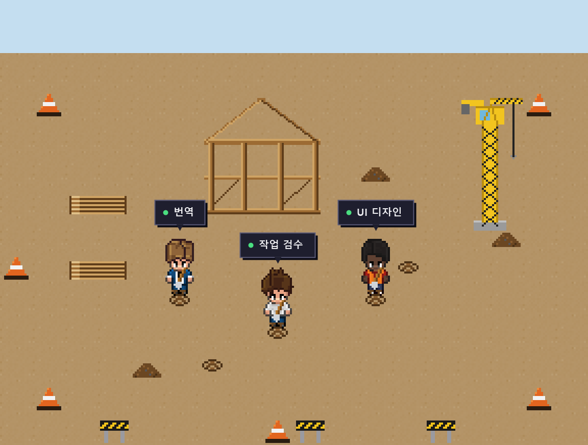

# 🏗️ Pixel Agents — 공사현장 에디션 + OpenRouter 멀티에이전트 Driver

[Pixel Agents](https://github.com/pixel-agents-hq/pixel-agents)(AI 에이전트가 픽셀 사무실 캐릭터로 살아 움직이는 VS Code 확장 / 독립 실행 앱)를
**공사현장 테마**로 개조하고, **OpenRouter 기반 멀티에이전트 Driver**를 붙인 실습 프로젝트입니다.

에이전트들은 사무실에서 타이핑하는 대신 **공사현장에서 삽을 들고 땅을 파는 인부**로 등장하고,
각자 맡은 업무(번역 · 작업 검수 · UI 디자인 · 문서 작성 · 데이터 분석 · 코드 리뷰)를 **말풍선**으로 보여줍니다.



> 위 이미지는 앱과 동일한 에셋으로 렌더링한 미리보기입니다. 실제 실행 화면을 캡처해
> `docs/screenshot.png`를 같은 이름으로 교체하면 README에 그대로 반영됩니다.

---

## ✨ 무엇을 만들었나

### 1) 공사현장 비주얼 개조 (`webview-ui/`, `core/`)
- **흙바닥**: 균일한 흙 텍스처 타일(`floors/floor_9.png`) + 낮은 대비 색조
- **공사 구조물 픽셀아트**: 건물 골조(`FRAME`), 타워크레인(`CRANE`), 목재 더미(`LUMBER`),
  안전콘(`CONE`), 바리케이드(`BARRICADE`), 흙더미(`DIRT_PILE`), 삽질 지점(`DIG_SPOT`)
- **삽질 애니메이션**: 캐릭터 스프라이트(`characters/char_0~5.png`)의 작업 프레임을
  "삽을 들고 땅을 파는" 2프레임 모션으로 리페인트, 앉지 않고 서서 작업(`CHARACTER_SITTING_OFFSET_PX = 0`)
- **공사현장 레이아웃**: `default-layout-2.json`
- **업무 말풍선**: `WorkTask` 도구로 전달된 한국어 업무명을 작업 중 캐릭터 머리 위에 상시 표시
  (`ToolOverlay.tsx`, 서버 `formatToolStatus`의 `WorkTask` 케이스)

### 2) OpenRouter 멀티에이전트 Driver (`driver/`)
실제 Claude Code 없이도, OpenRouter LLM이 매 턴 "다음 행동"을 정하고
그 결과를 **Hook**으로 Pixel Agents 서버에 보내 캐릭터를 움직이는 독립 PoC 패키지입니다.

```
loop → planner(OpenRouter 호출) → validator → executor(Hook 전송) → 반복
```

- 여러 에이전트(`AGENT_1_*`, `AGENT_2_*`, …)를 `.env`로 정의해 동시 구동
- 서버의 `POST /api/hooks/claude`로 `SessionStart / PreToolUse / PostToolUse / Stop` 전송
- API 호출 실패(429/5xx)는 지수 백오프 재시도, 한 턴 실패는 건너뛰고 계속

---

## 🚀 실행 방법

### 0) 사전 준비
- Node.js (`.nvmrc` 참고)
- [OpenRouter](https://openrouter.ai) API 키

### 1) 의존성 설치 & 빌드 (저장소 루트)
```powershell
npm install
node esbuild.js --production   # dist/cli.js, dist/assets, dist/hooks
npm run build:webview          # dist/webview (브라우저 화면)
```

### 2) 공사현장 서버 실행
```powershell
node dist/cli.js --port 3100
```
브라우저에서 **http://localhost:3100** 을 열면 빈 공사현장(흙바닥 · 골조 · 크레인 · 소품)이 보입니다.

### 3) Driver 실행 (인부 투입)
```powershell
cd driver
npm install
Copy-Item .env.example .env    # 그리고 .env에 OPENROUTER_API_KEY 입력
npm start
```
김대리 · 박주임이 등장 → 삽질 지점으로 걸어가 → 업무 말풍선을 띄우며 땅을 팝니다.

> ⚠️ `driver/.env`의 `PIXEL_AGENTS_WORKSPACE`는 **서버를 실행한 폴더와 일치**해야
> 캐릭터가 화면에 잡힙니다. 기본값은 driver를 실행한 폴더입니다.

---

## ⚙️ driver/.env 주요 설정

| 변수 | 설명 |
|------|------|
| `OPENROUTER_API_KEY` | OpenRouter API 키 (필수) |
| `LLM_MODEL` / `AGENT_<n>_MODEL` | 사용할 모델 ID (예: `openai/gpt-4o-mini`) |
| `AGENT_<n>_NAME` / `_SYSTEM_PROMPT` / `_API_KEY` | 에이전트별 이름·성격·키(선택) |
| `PIXEL_AGENTS_WORKSPACE` | 서버가 스캔하는 작업공간(서버 실행 폴더와 일치) |

> 🔐 `.env`는 `.gitignore`에 포함되어 깃에 올라가지 않습니다. 키를 코드에 직접 넣지 마세요.

---

## 📁 주요 구조

```
driver/                         OpenRouter 멀티에이전트 Driver (독립 패키지)
  index.ts                      진입점(데모 루프)
  planner.ts / openrouter.ts    LLM 호출로 다음 행동 결정
  validator.ts                  행동 JSON 검증(실패 시 rest 폴백)
  executor.ts / actions.ts      업무 실행 + Hook(PreToolUse 등) 전송
  office.ts / transcript.ts     서버 Hook 전송 / 트랜스크립트 기록

webview-ui/public/assets/
  characters/char_0~5.png       삽질 모션으로 리페인트된 캐릭터
  floors/floor_9.png            흙바닥 타일
  furniture/{FRAME,CRANE,...}   공사 구조물·소품
  default-layout-2.json         공사현장 레이아웃
webview-ui/src/office/components/ToolOverlay.tsx   업무 말풍선
server/src/providers/hook/claude/claude.ts         WorkTask 라벨 처리
```

자세한 원본 아키텍처는 [`CLAUDE.md`](CLAUDE.md)를 참고하세요.

---

## 🙏 크레딧 & 라이선스

이 프로젝트는 [**pixel-agents-hq/pixel-agents**](https://github.com/pixel-agents-hq/pixel-agents)(MIT License)를
기반으로 개조한 것입니다. 원본 저작권 및 라이선스는 [`LICENSE`](LICENSE)에 그대로 유지됩니다.
공사현장 테마·삽질 모션·OpenRouter Driver·업무 말풍선 부분이 추가/변경된 내용입니다.
